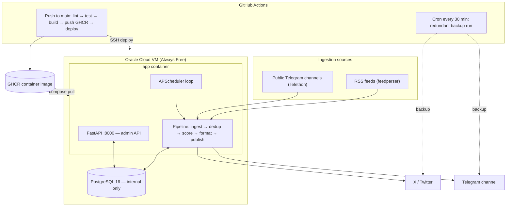

# GigSwift Agent

> Turning fragmented gig opportunities into instant, high-signal alerts.


GigSwift Agent ingests remote job and gig listings from free RSS feeds and public
Telegram channels, deduplicates and scores them against configurable rules, renders
a branded image card, and posts the best listings to X (Twitter) and Telegram on a
fixed interval. It runs 24/7 on an Oracle Cloud Always Free VM under Docker Compose,
with GitHub Actions handling CI/CD and a redundant scheduled backup runner. Ongoing
cost is zero.

## What it does

- Pulls listings from RSS feeds (feedparser) and public Telegram channels (Telethon).
- Deduplicates by content hash, drops scams by keyword, and scores each listing 0.0–1.0.
- Posts listings above a configurable threshold, capped per run, to X and Telegram.
- Generates a 1200×630 PNG card per post with Pillow (no external image API).
- Retries failed publishes with backoff and records every attempt in the database.
- Exposes a small read-only admin API for run history, errors, and stats.

## Architecture



Each cycle, the scheduler fetches all sources concurrently, runs the pipeline
(dedup → scam filter → score → threshold), formats survivors into platform text plus
a Pillow card, and publishes them with retry. The 30-minute GitHub Actions cron runs
the same pipeline once as a backup, independent of the VM.

## Tech stack

| Layer | Technology | Reason |
|---|---|---|
| Web framework | FastAPI 0.111 | Async, auto-docs, Pydantic-native |
| Scheduler | APScheduler 3.x | Runs inside app container, no extra infra |
| ORM | SQLAlchemy 2.0 (async) | Pairs with FastAPI async naturally |
| Migrations | Alembic | Schema evolution, shows production thinking |
| Database | PostgreSQL 16 | Via Docker container on Oracle VM |
| RSS ingestion | feedparser | Simple, battle-tested, zero cost |
| Telegram read | Telethon | MTProto client, reads public channels |
| X posting | tweepy 4.x | Official library, free tier write access |
| Telegram post | python-telegram-bot 21.x | Official bot library |
| Image generation | Pillow | Generates branded cards, no external API |
| Config | Pydantic BaseSettings | Validates env vars at startup, fails fast |
| Linting | ruff | Fast, replaces flake8 + black + isort |
| Testing | pytest + pytest-asyncio + httpx | Async-safe, covers FastAPI routes |
| Containerisation | Docker + Docker Compose | Two services: app + db |
| CI/CD | GitHub Actions | Lint, test, build, push GHCR, SSH deploy |
| Image registry | GHCR (GitHub Container Registry) | Free, integrated with Actions |
| Hosting | Oracle Cloud Always Free | 1 AMD vCPU, 1 GB RAM, free forever |

## Tech decisions

- **APScheduler over Temporal.io** — Temporal solves durable execution across many
  distributed workers, which a single-worker, single-pipeline system does not need.
  APScheduler runs in-process inside the app container, so it adds no servers, UI, or
  setup for zero benefit at this scale.
- **PostgreSQL over SQLite** — The service runs in Docker against a named volume and
  benefits from real async support (asyncpg), connection pooling, and concurrent
  access. SQLite is fine for scripts; Postgres is the honest choice for a long-running
  service.
- **Oracle Cloud Always Free over Railway/Render** — Railway caps free usage with a
  credit limit and Render's free tier spins down when idle, neither of which suits an
  always-on poster. Oracle's Always Free tier is genuinely always-on at no recurring
  cost, with the one-time tradeoff of a card-verified signup.
- **Read-only admin API over a dashboard** — A React dashboard would add weeks of work
  and deliver no pipeline value. The FastAPI admin endpoints expose the same run
  history and stats, are readable in a browser or via curl, and keep effort on the
  pipeline itself.

## Running locally

```bash
git clone https://github.com/<owner>/gigswift.git
cd gigswift

# Configure: copy the template and fill in values.
cp .env.example .env
#   DB_PASSWORD=devpassword      # must match docker-compose.override.yml
#   GITHUB_USERNAME=<any value>  # only used to tag the locally built image
#   X_* and TELEGRAM_* credentials, RSS_FEED_URLS, TELEGRAM_CHANNELS

# Create the schema, then start the stack.
docker compose run --rm app alembic upgrade head
docker compose up
```

The git-ignored `docker-compose.override.yml` makes `docker compose up` build the
image from source, bind-mount `app/` for hot reload, and use the human-readable log
format. Once running, the API is at `http://localhost:8000` — try
`/health`, `/admin/runs`, and `/admin/stats`.

> Posting to X and Telegram requires real credentials; with placeholder values the
> pipeline runs but publish attempts fail and are logged (visible at `/admin/errors`).

## Environment variables

All variables live in `.env` (see `.env.example`). Required variables have no default
and the app fails fast at startup if they are missing.

| Variable | Default | Description |
|---|---|---|
| `DATABASE_URL` | — | Async Postgres DSN: `postgresql+asyncpg://user:pw@host:5432/db` |
| `X_API_KEY` | — | X (Twitter) API key |
| `X_API_SECRET` | — | X API secret |
| `X_ACCESS_TOKEN` | — | X access token for the posting account |
| `X_ACCESS_SECRET` | — | X access token secret |
| `TELEGRAM_BOT_TOKEN` | — | Bot token from @BotFather (used to post) |
| `TELEGRAM_CHANNEL_ID` | — | Target channel, e.g. `@gigswift_jobs` or `-100…` |
| `TELEGRAM_API_ID` | — | Telethon app id from my.telegram.org (used to read) |
| `TELEGRAM_API_HASH` | — | Telethon app hash |
| `RSS_FEED_URLS` | — | Comma-separated RSS feed URLs |
| `TELEGRAM_CHANNELS` | — | Comma-separated channels to read |
| `MIN_SCORE_THRESHOLD` | `0.5` | Minimum score (0.0–1.0) required to post |
| `MIN_PAY_HOURLY` | `15.0` | Hourly pay floor used in scoring |
| `SCHEDULER_INTERVAL_MINUTES` | `30` | Minutes between pipeline runs |
| `MAX_POSTS_PER_RUN` | `5` | Cap on posts published per run |
| `DB_PASSWORD` | — | Postgres password, interpolated into `docker-compose.yml` |
| `GITHUB_USERNAME` | — | GHCR owner for the image: `ghcr.io/<user>/gigswift` |
| `LOG_FORMAT` | `console` | `json` for structured logs in production; anything else is human-readable |

## CI/CD

Two workflows live in [`.github/workflows`](.github/workflows):

**`ci.yml`** runs on every push/PR to `main` and on a `*/30` cron:

1. **lint** — `ruff check` and `ruff format --check` (ruff is version-pinned to match local).
2. **test** — `pytest` with coverage; tests use in-memory SQLite, so no service containers are needed.
3. **build-and-push** — on pushes to `main` only: build the Docker image and push it to GHCR.
4. **deploy** — on pushes to `main` only: SSH to the Oracle VM, `docker compose pull`, apply
   migrations in a throwaway container (`docker compose run --rm app alembic upgrade head`),
   then `docker compose up -d`.
5. **run-pipeline** — on the cron only: install deps and run `python -m app.scheduler --once`
   as a redundant backup, independent of the VM.

**`manual-deploy.yml`** is a `workflow_dispatch` job that runs the same pull → migrate →
up sequence on demand (no push required), useful when the Oracle VM is rebuilt.

### Required GitHub Secrets

Configure these under **Settings → Secrets and variables → Actions**. No values are
committed anywhere; every value is read from the GitHub Secrets context at run time and
mirrored in the VM's `.env` for `docker compose`.

| Secret | Used by | Purpose |
|---|---|---|
| `DATABASE_URL` | scheduled backup runner | Async Postgres DSN |
| `DB_PASSWORD` | deploy / VM `.env` | Postgres password for `docker-compose.yml` |
| `X_API_KEY` | backup runner / VM `.env` | X API key |
| `X_API_SECRET` | backup runner / VM `.env` | X API secret |
| `X_ACCESS_TOKEN` | backup runner / VM `.env` | X access token |
| `X_ACCESS_SECRET` | backup runner / VM `.env` | X access token secret |
| `TELEGRAM_BOT_TOKEN` | backup runner / VM `.env` | Bot token from @BotFather |
| `TELEGRAM_CHANNEL_ID` | backup runner / VM `.env` | Target channel id/handle |
| `TELEGRAM_API_ID` | backup runner / VM `.env` | Telethon app id |
| `TELEGRAM_API_HASH` | backup runner / VM `.env` | Telethon app hash |
| `RSS_FEED_URLS` | backup runner / VM `.env` | Comma-separated RSS feed URLs |
| `TELEGRAM_CHANNELS` | backup runner / VM `.env` | Comma-separated channels to read |
| `ORACLE_HOST` | deploy | Oracle VM hostname / IP for SSH |
| `ORACLE_USER` | deploy | SSH user on the Oracle VM |
| `ORACLE_SSH_KEY` | deploy | Private SSH key authorized on the Oracle VM |

> `GITHUB_TOKEN` is provided automatically by GitHub Actions (used to push to GHCR) and
> does not need to be created. The image is published to `ghcr.io/<owner>/gigswift:latest`.

### Oracle VM Setup (first deploy only)

1. SSH into the VM
2. `sudo mkdir -p /opt/gigswift`
3. Copy `.env.example` to `/opt/gigswift/.env` and fill all values
   including DB_PASSWORD, all X_ and TELEGRAM_ secrets, RSS_FEED_URLS,
   and TELEGRAM_CHANNELS
4. `cd /opt/gigswift && docker compose pull`
5. `docker compose run --rm app alembic upgrade head`
6. `docker compose up -d`

Note: the `.env` on the VM must contain all required variables, not
just DATABASE_URL, because the migration container imports the full
app settings on startup.

Subsequent deploys are fully automated via GitHub Actions.

## Live outputs

Links are added once the channels are created.

- Telegram channel: https://t.me/gigswiftjobs
- LinkedIn: https://www.linkedin.com/company/134374149
- X (Twitter): coming soon

## Roadmap

- **WhatsApp posting (v2)** — pending a viable free/low-cost channel API.
- **Improved scoring** — better pay parsing (annual vs hourly), recency weighting, and
  source reputation.
- **Web dashboard** — a lightweight UI over the existing admin API for browsing runs and
  posted listings.

## License

MIT
